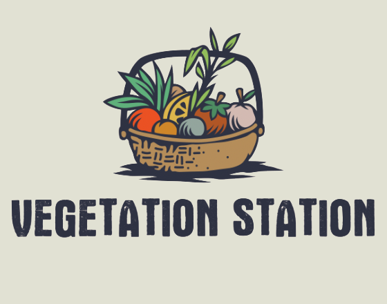

# Vegetation Station

_The Official Repository for the Vegetation Station Mobile App_\

## Introduction

This project was a one-week challenge to design and execute a full-stack web application with a team of engineers while utilizing agile workflow based on a client's specific request.

- Our client wanted an application that allowed users to trade plants for other plants. They wanted strong user authentication to safely access the wanted features like accurate locations being displayed on a map, take and import pictures of the plants they were trading, live messaging between users, and more.

- As a team of 7 engineers, we built a fully functioning application that met the above requirements in 7 days.

## Description

### The problem and the client

- Vegetation Station is a mobile plant trading app. It allows plant lovers to post their unwanted plants online and to make trades for other users' plants.

- Our primary market for this application was college students, millennials, gardeners, and all plant lovers.

### User Inputs and Outputs - Users have the ability to interact with each other to complete plant-for-plant trades.

- Users can post plants to the app and receive incoming trade offers
- Users can make offers for plants that have already been posted to the app
- Users can message other users to ask questions, negotiate, and arrange trades
- Users can see the general geographical area that other users post their trades from

## Challenges

- The overall technical challenges we faced was designing and executing such a large-scale application in such a short time while also making it look professional. Our team solved this by implementing redux to manage all of the states that would be utilized throughout the application, react-router to handle the navigation between pages, and firebase to handle authentication for the app.

## Video Demo

Login

Home Page

Plant Details

Post A Plant

Messaging

Profiles

Trade Proposals

## User story and MVP

- Provide users with the ability to trade their plants for other plants.
- Allows users to communicate with each other to work out the details of their trades.
- Identify trades that are within a general location around the user.
- Users can post plants to the trading board which allows them to seek out someone who wants it and to show off their plants.
- Serve as a medium in which revenue-generating advertising can be strategically placed.

## How does the app work?

- Behind the scenes
  - Authentication is handled through Firebase, with user data being stored on a local server. Email and Google account based authentication were implemented. We separated authentication and account management logic as a way to mitigate the risk of data breaches on the server.
  - Upon initial rendering of the page, the users information is pulled from the database utilizing axios, express, and firebase queries
  - The users data is utilized to conditional render their homepage, profile, trade proposal, and messages
  - Redux state is leveraged to render initial settings and update the display as the user makes changes, with data being updated in the backend simultaneously.
  - Common data shared by components is held in Redux. Data unique to a rendered page is held in state, then sent to the database via axios when appropriate.
  - On the backend, the data is organized and stored on the database server using Firebase as the database management system
- How does the tech stack come together?
  - Components of our tech stack communicate seemlessly: Redux directing rendering and axios request to the backend, the backend recieving those request with express.js and processing them with node.js to store them in a firebase database.

### Front End Notes

- `eslint` has been configured with the AirBnB style guide

### Getting started: Developer Tools

- Download the Expo Go App
  - In your terminal, execute npx expo whoami
  - Then execute npx expo login
  - Login
  - Then execute npx expo whoami to confirm you're logged in
  - Log into the Expo Go App
  - Run the npm start script in the repository

## Contributors

Thomas Saldana (Project Manager)\

Mo Akbari (Architecture Owner)\

Wonseok Park (UI Owner)\

Kyle Martinelli\

Brain Anusiem\

Ryan Gehris\

Matt Sigler\

## Technology Used

**Front-end:** &emsp;&nbsp;&nbsp;

**Back-end:** &emsp;&nbsp; &nbsp;

## Thanks for Reading!

If you've made it all the way down here, we thank you for reading and we hope you enjoy our application.

## MAX's thoughts™

- I thought it was really interesting being able to trade plants. I think that was a really good idea. Maybe trade illegal plants? Could there be a Vegetation Station after Dark?
